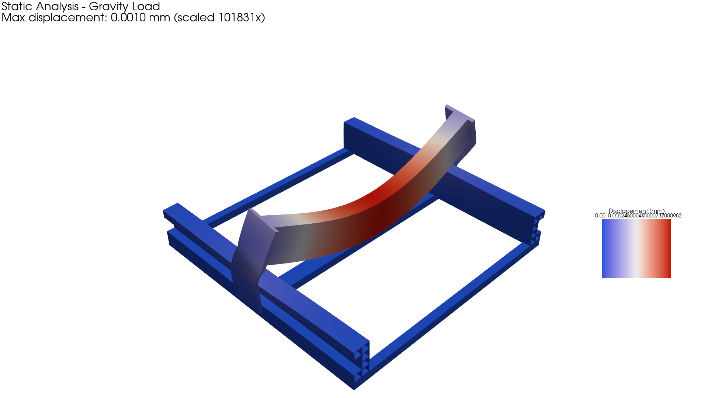
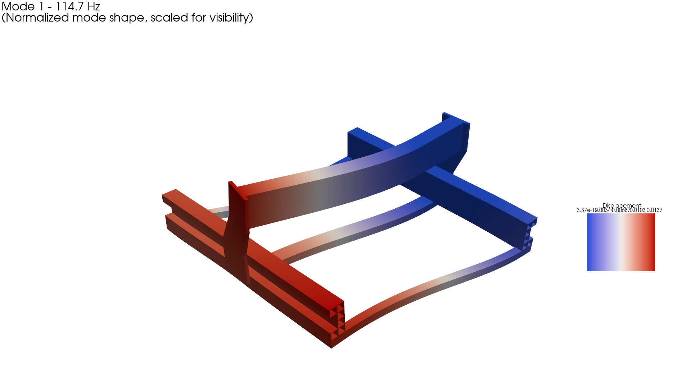
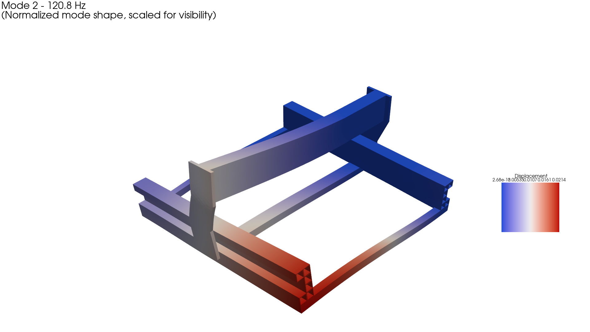
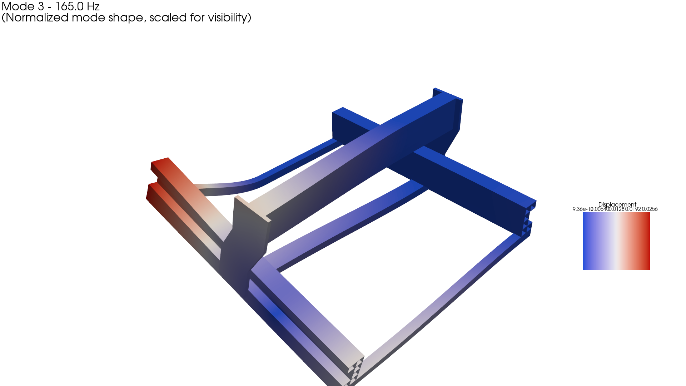
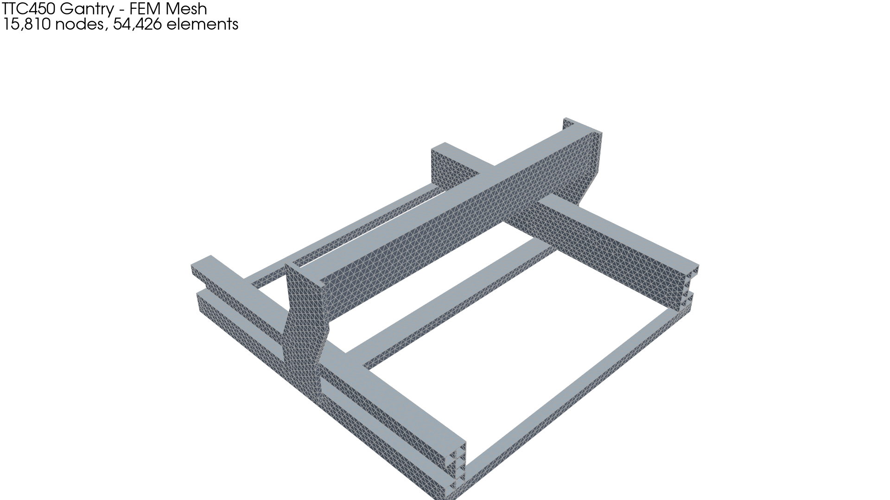

# CNC Gantry FEM Analysis

Finite Element Analysis of a TwoTrees TTC450-style CNC gantry structure using FEniCSx.

## Overview

This project performs structural analysis of a CNC router gantry to evaluate:
- **Static deflection** under gravity and cutting loads
- **Natural frequencies** and mode shapes for chatter prediction
- **MPC tie constraints** for multi-part assemblies

The geometry is based on the TwoTrees TTC450 Pro desktop CNC, modeled with parametric 4080 C-beam aluminum extrusion profiles.

## Results Summary

### Static Analysis (Gravity Load)



| Metric | Value |
|--------|-------|
| Max displacement | **0.001 mm** (1 µm) |
| Location | Top of X-gantry beam |
| Scale factor | 100,000× (exaggerated for visualization) |

The structure is very stiff under self-weight. Primary deflection is X-beam sag, with minor contribution from riser plate bending.

### Modal Analysis (Natural Frequencies)

| Mode | Frequency | Description |
|------|-----------|-------------|
| 1 | **114.7 Hz** | Base frame Y-shear (Y-beams out of phase) |
| 2 | **120.8 Hz** | Lateral/torsional mode |
| 3 | **165.0 Hz** | Higher-order bending |
| 4 | **359.5 Hz** | Combined mode |
| 5 | **373.9 Hz** | Combined mode |
| 6 | **443.2 Hz** | Higher frequency mode |

#### Mode 1 - 114.7 Hz (Base Frame Y-Shear)


#### Mode 2 - 120.8 Hz


#### Mode 3 - 165.0 Hz


---

## Geometry

### Components

| Component | Description | Material |
|-----------|-------------|----------|
| Base frame | 600×600mm 2020 extrusion square with 2040 cross-brace | AL 6061-T6 |
| Y-beams (×2) | 4080 C-beam, 600mm long, C-slot facing outward | AL 6061-T6 |
| X-gantry beam | 4080 C-beam, 600mm long, C-slot facing rear | AL 6061-T6 |
| Riser plates (×2) | 8mm thick, 80×240mm with 23° parallelogram lean | AL 6061-T6 |

### 4080 C-Beam Profile

The C-beam is modeled as 6 hollow 2020 cores in a 2×4 arrangement with 2 missing:
```
{{■,■,■,■},   ← Top row (4 cores)
 {■,□,□,■}}  ← Bottom row (2 cores, C-slot opening in middle)
```

Wall thickness: **1.5mm** (calibrated to match actual C-beam cross-sectional area of ~666 mm²)

### FEM Mesh



- **Nodes:** 15,810
- **Elements:** 54,426 (tetrahedra)
- **Boundary conditions:** Base frame bottom face fixed (Z=0)

---

## Quick Start

### Generate Mesh (Fused Geometry)
```bash
python fem/geometry/generate_ttc450_simple.py
```

### Run FEM Analysis
```bash
python fem/analysis/run_ttc450_analysis.py
```

### Generate Visualization Images
```bash
python fem/visualization/render_results.py
```

### View Results in ParaView
```bash
paraview fem/results/ttc450_static_gravity.xdmf
paraview fem/results/ttc450_modes/mode_01_114.7Hz.xdmf
```

---

## Alternative: MPC Tie Workflow

For multi-part assemblies with tagged coupling surfaces:

### Create Combined Mesh
```bash
python fem/analysis/run_ttc450_mpc.py --mesh-only
```

### Run MPC Tie Solve
```bash
python fem/analysis/run_ttc450_mpc.py
```

Defaults:
- `--gap 0.2`
- `--mesh-min 8`
- `--mesh-max 25`
- `--profile cshape`

Optional flags:
- `--mesh-only` generate mesh only
- `--self-check` print facet tag counts
- `--write-xdmf` export XDMF for ParaView
- `--write-tags-json` write tag IDs + counts JSON

### Tag Names for Coupling

Physical Groups:
- `x_beam_end_left`, `x_beam_end_right`
- `riser_left_inner`, `riser_right_inner`

Volume names:
- `x_beam`, `y_beam_left`, `y_beam_right`
- `riser_left`, `riser_right`
- `base_frame` (optional)

---

## Chatter Analysis

The first natural frequency of ~115 Hz sets the lower bound for stable cutting conditions:

| Flutes | Critical RPM @ Mode 1 |
|--------|----------------------|
| 1 | 6,882 RPM |
| 2 | 3,441 RPM |
| 3 | 2,294 RPM |
| 4 | 1,720 RPM |

All critical RPMs are below typical spindle range (8,000-24,000 RPM), so Mode 1 resonance is unlikely during normal operation.

## Design Observations

1. **Weakest link:** The 2020 base frame is less stiff than the 4080 gantry beams, limiting Mode 1 frequency
2. **Potential improvements:**
   - Heavier base frame (4040 or steel tube)
   - Diagonal bracing in base plane
   - Cross-bracing between Y-beams at floor level
   - Gussets at riser plate base corners

---

## Dependencies

### Core
- [gmsh](https://gmsh.info/) with OCC kernel
- [FEniCSx](https://fenicsproject.org/) (dolfinx)
- [SLEPc](https://slepc.upv.es/) for eigenvalue problems
- [PETSc](https://petsc.org/)

### Visualization
- [PyVista](https://pyvista.org/) for batch rendering
- [ParaView](https://www.paraview.org/) for interactive viewing

### Optional
- `dolfinx_mpc` for MPC tie constraints

### Installation (Ubuntu/Debian)

```bash
# FEniCSx and dependencies
sudo apt install fenicsx python3-dolfinx python3-slepc4py

# Meshing
sudo apt install gmsh python3-gmsh

# Visualization
pip install pyvista h5py
```

### Installation (Conda)

```bash
mamba create -n cnc-fem -c conda-forge fenics-dolfinx gmsh meshio dolfinx_mpc pyvista
mamba activate cnc-fem
```

---

## File Structure

```
CNC/
├── fem/
│   ├── analysis/
│   │   ├── fenicsx_static.py      # Static solver module
│   │   ├── fenicsx_modal.py       # Modal solver module
│   │   ├── run_ttc450_analysis.py # Main analysis script
│   │   └── run_ttc450_mpc.py      # MPC tie workflow
│   ├── geometry/
│   │   ├── generate_ttc450_simple.py  # Fused mesh generator
│   │   ├── mesh_generator.py          # Multi-part generator
│   │   └── calc_moment_of_inertia.py  # C-beam calibration
│   ├── visualization/
│   │   └── render_results.py      # Image generation
│   ├── results/
│   │   ├── ttc450_hollow.msh      # Generated mesh
│   │   ├── ttc450_static_gravity.* # Static results
│   │   └── ttc450_modes/          # Modal results
│   └── config.py                  # Material properties, load cases
├── docs/
│   └── images/                    # Result visualizations
└── README.md
```

---

## License

MIT
